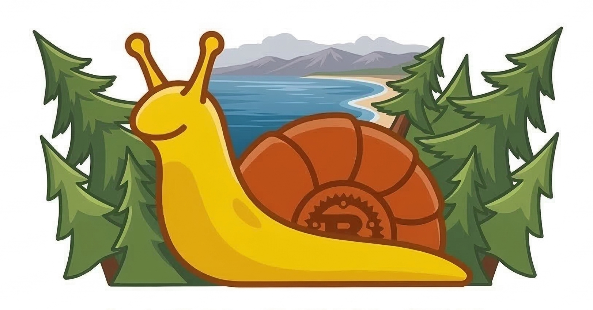

<p align="center">
  
</p>

<h1 align="center">slug-mcp</h1>

<p align="center">
  An <a href="https://modelcontextprotocol.io/">MCP</a> server that gives AI assistants live access to UC Santa Cruz <em>and</em> the Santa Cruz coast — campus services, transit, surf, tides, weather, beach water quality, traffic, wildfires, trails, climbing, and more.<br/>
  All of it stitched together so your assistant can answer questions no single website can.<br/><br/>
  Built in Rust with <a href="https://github.com/anthropics/rmcp">rmcp</a> for the UCSC and Santa Cruz community.
</p>

---

## Why?

Living in Santa Cruz means juggling a dozen disconnected sources — PISA, LibCal, campusrec, SC Metro, NWS, CDIP, BeachWatch, Caltrans, the events calendar. None of them talk to each other.

slug-mcp is purpose-built for this place: campus services *and* Santa Cruz city/county data behind one MCP interface. Your assistant fuses them to answer questions no single site can:

> **"Is dawn patrol at Steamer Lane worth it tomorrow, and can I still make my 9am in Baskin after?"**
>
> The assistant pulls the marine forecast and 8 AM tide for Steamer Lane, checks sunrise and morning wind, looks up your class location, then gets the next bus from Lighthouse Field to Science Hill. One question, six services, ten seconds.

## Try These

Real questions that come up living and studying in Santa Cruz — each one threads multiple services together:

| Prompt | What happens behind the scenes |
|--------|-------------------------------|
| *"Storm just rolled through — is the water safe to swim at Cowell's, and is the swell back down to longboard size?"* | Pulls the latest BeachWatch bacteria results for Cowell's, gets the marine forecast and wave-buoy spectra, cross-references with the next low tide |
| *"Should I bike to campus or take the bus today?"* | 7-day NWS forecast, current AQI plus smoke from active NASA FIRMS detections, real-time bus ETAs, per-route delay stats |
| *"My parents are visiting Saturday. What's open downtown for dinner, what's the tide doing, and are there any events?"* | Tide predictions for Monterey station, campus and Eventbrite events search, dining hours, weekend weather forecast |
| *"Plan a tide-pool walk at Natural Bridges this week — when's the lowest daytime tide and what's the weather doing?"* | Tide tables filtered to daylight hours via sunrise/sunset, NWS coastal forecast (CAZ529), current beach water quality |
| *"Hwy 17 had a closure earlier — is my evening commute home going to be brutal?"* | Live CHP incidents, Caltrans D5 lane closures on Hwy 17, traffic summary, evening weather |
| *"I want to study for 3 hours then hit the gym — find me a quiet library room and tell me when the rec center will be least crowded."* | LibCal availability across McHenry and S&E, live rec headcount with recent trend, dining hours for after |
| *"Looking for a Friday afternoon climb near Castle Rock — what's the weather doing and how's the drive?"* | OpenBeta route search, OSM trail and peak data, NWS mountains forecast (CAZ512), Hwy 9 incidents and lane closures |
| *"Find me a high-protein dinner near my 4 PM class in Baskin, then a study room that closes after 10."* | Class schedule lookup, dining menus with nutrition ranked by protein, walking-distance dining hours, late-night LibCal availability |
| *"Is it worth driving up to Big Basin tomorrow, or is the AQI still bad from the fires?"* | NASA FIRMS satellite fire detections, AirNow current AQI, Open-Meteo air-quality forecast, NPS park status, NWS forecast |

## Features

### UC Santa Cruz

| Service | Tools |
|---------|-------|
| **Dining** | Menus for all 5 dining halls with dietary/allergen tags, nutrition facts per item, operating hours, Slug Points / Banana Bucks balance |
| **Events** | Search campus events by keyword or category, plus Eventbrite community events for full coverage, list upcoming chronologically |
| **Recreation** | Live headcounts for gym, pool, fields, climbing wall, wellness center; facility schedules; group exercise class search |
| **Library** | Study room availability at McHenry and S&E by time slot, room booking |
| **Academics** | Class search by subject, instructor, GE, course number, career level — enrollment, meeting times, instruction mode; degree requirements + progress tracking; faculty/staff directory |
| **Classrooms** | Find rooms by capacity, building, AV equipment, seating style, accessibility |
| **Transit** | Real-time SC Metro bus predictions, GTFS-RT vehicle positions, system + route service alerts, per-route delay stats |

### Santa Cruz coast & county

| Service | Tools |
|---------|-------|
| **Weather** | NOAA NWS 7-day forecasts and active alerts for coastal (CAZ529) and mountains (CAZ512) zones |
| **Surf & Marine** | Open-Meteo marine forecasts and surf conditions for Steamer Lane, Pleasure Point, Cowell's, Natural Bridges, The Hook, Manresa; NDBC buoy observations and CDIP waverider swell spectra; NOAA tide predictions |
| **Beach Water Quality** | CA BeachWatch bacteria monitoring (Enterococcus, E. coli, total coliform) for 24+ Santa Cruz County beaches |
| **Traffic** | CHP incidents and Caltrans District 5 lane closures for Hwy 1 / 9 / 17 / 101 |
| **Wildfires & Air** | NASA FIRMS satellite fire detections for SC County, AirNow current AQI, Open-Meteo air-quality and pollen forecasts |
| **Outdoors** | OpenStreetMap trails, peaks, viewpoints, amenities; OpenBeta climbing routes; National Park Service info |
| **Sky & Earth** | Sun/moon/twilight + UV index; NOAA SWPC space weather (Kp, storm scales, solar wind); USGS earthquakes; USGS real-time stream conditions; iNaturalist + eBird species observations |

## Quick Start

**Prerequisites:** Rust 1.75+, Chrome/Chromium (for authenticated tools only)

```bash
git clone git@github.com:pronei/slug-mcp.git
cd slug-mcp
cargo build --release
```

## Client Setup

The fastest path is the hosted instance — no build required. Build locally if you want authenticated tools (meal balance, room booking) or to run your own server.

### Hosted (no install)

A public instance is hosted on the UCSC ITS infra at:

```
https://2262-cse115b-02.be.ucsc.edu/mcp
```

Read-only tools work out of the box. Authenticated tools require a portable token (see [Authentication](#authentication)).

**Claude Code:**

```bash
claude mcp add --transport http slug-mcp https://2262-cse115b-02.be.ucsc.edu/mcp
```

**Claude Desktop / other HTTP-MCP clients:**

```json
{
  "mcpServers": {
    "slug-mcp": {
      "url": "https://2262-cse115b-02.be.ucsc.edu/mcp"
    }
  }
}
```

### Local — Claude Desktop

Add to `~/Library/Application Support/Claude/claude_desktop_config.json` (macOS) or `%APPDATA%\Claude\claude_desktop_config.json` (Windows):

```json
{
  "mcpServers": {
    "slug-mcp": {
      "command": "/path/to/slug-mcp"
    }
  }
}
```

### Local — Claude Code

```bash
claude mcp add slug-mcp /path/to/slug-mcp
```

### ChatGPT Desktop

Open **ChatGPT** > **Settings** > **Beta Features** > enable **MCP Servers**, then:

**Settings** > **MCP Servers** > **Add Server** > **Command-line (stdio)**

- **Name:** `slug-mcp`
- **Command:** `/path/to/slug-mcp`

### Any MCP-compatible client

Run `/path/to/slug-mcp` as a stdio subprocess — no arguments needed.

For remote connections, start the SSE server and point your client at the endpoint (see [Running Your Own Server](#running-your-own-server)).

## Authentication

> ⚠️ **Work in progress.** The CruzID + Duo MFA flow is functional locally but not yet stable across the hosted server, headless environments, and all clients. Expect rough edges — flow details, token format, and the `login` / `authenticate` / `export-token` surface may change. Read-only tools are unaffected; the items below are the only ones gated on auth.

Most tools work without login. Two tools require UCSC authentication:
- **Meal balance** — Slug Points / Banana Bucks
- **Room booking** — reserve study rooms

When you ask for something that needs auth, the assistant will call the `login` tool, which opens a Chrome window for CruzID + Duo MFA. The session is captured automatically and lasts 8 hours.

For remote/headless servers where a browser can't open, generate a portable token locally:

```bash
slug-mcp export-token    # opens browser, prints base64 token
```

Then pass the token to the `authenticate` tool on the remote server.

## Running Your Own Server

```bash
# Start the SSE server
./slug-mcp serve --sse --port 3000
```

For production, put a reverse proxy in front for TLS:

```
# Caddyfile
slug-mcp.example.com {
    reverse_proxy localhost:3000
}
```

The server handles multiple concurrent clients. Each SSE session gets its own isolated auth state via the rmcp session factory. Shared resources (cache, HTTP client) are `Arc`-wrapped and thread-safe.

## Architecture

```
src/
├── main.rs              # CLI (serve / export-token) + service wiring
├── server.rs            # MCP tool handlers (rmcp macros)
├── cache.rs             # Moka TTL cache
├── auth/
│   ├── mod.rs           # AuthManager, SAML-aware HTTP client
│   ├── browser.rs       # Chrome CDP for Shibboleth + Duo login
│   ├── session.rs       # AES-256-GCM encrypted session storage
│   └── token.rs         # Portable base64 token encode/decode
├── dining/              # Menu scraping, nutrition, hours, balance
├── events/              # Tribe Events REST API client
├── recreation/          # Facility occupancy + schedules
├── library/             # LibCal study room availability + booking
├── academics/           # PISA class search + campus directory
├── classrooms/          # Classroom directory + campus locations
├── transit/             # Santa Cruz Metro real-time predictions
├── tides/               # NOAA CO-OPS tide predictions
├── buoy/                # NDBC realtime2 weather + ocean buoys
├── wave_buoy/           # CDIP/NDBC .spec swell vs wind-wave
├── usgs_water/          # USGS NWIS instantaneous stream conditions
├── biodiversity/        # iNaturalist + eBird species observations
├── air_quality/         # EPA AirNow current AQI by ZIP
├── air_forecast/        # Open-Meteo air quality + pollen forecast
├── astronomy/           # Sun/moon/twilight + UV index
├── space_weather/       # NOAA SWPC Kp + storm scales + solar wind
├── outdoors/            # OSM Overpass: trails, peaks, viewpoints
├── climbing/            # OpenBeta GraphQL climbing routes
├── earthquakes/         # USGS recent seismic events
├── beach_water/         # CA BeachWatch bacteria monitoring
└── nps/                 # National Park Service Developer API
```

### Optional API keys

Several Santa Cruz and field-research tools need free registration with the upstream provider. Missing keys produce a friendly "not configured" message instead of erroring — the rest of the server keeps working.

The exception is **`SLUG_MCP_BUSTIME_KEY`**: the SC Metro stops catalog is loaded via BusTime, so transit tools won't return predictions without it. Real-time positions and alerts come from GTFS-RT and work without a key.

| Env var | Needed by | Get one |
|---------|-----------|---------|
| `SLUG_MCP_BUSTIME_KEY` | `get_bus_predictions`, stop lookups | <https://rt.scmetro.org> (developer access) |
| `SLUG_MCP_EVENTBRITE_KEY` | `search_eventbrite_events` | <https://www.eventbrite.com/platform/api> |
| `SLUG_MCP_FIRMS_KEY` | `get_fire_detections` | <https://firms.modaps.eosdis.nasa.gov/api/area/> |
| `AIRNOW_API_KEY` | `get_air_quality` | <https://docs.airnowapi.org/> |
| `EBIRD_API_KEY` | `search_bird_observations` | <https://ebird.org/api/keygen> |
| `NPS_API_KEY` | `get_national_park_info` | <https://www.nps.gov/subjects/developer/get-started.htm> |

The hosted instance ships with these configured — set them yourself only if you're running locally.

Each module follows the pattern: `scraper.rs` (HTTP + HTML parsing) > `mod.rs` (service layer with caching) > `server.rs` (MCP tool handler).

## License

[MIT](LICENSE)
